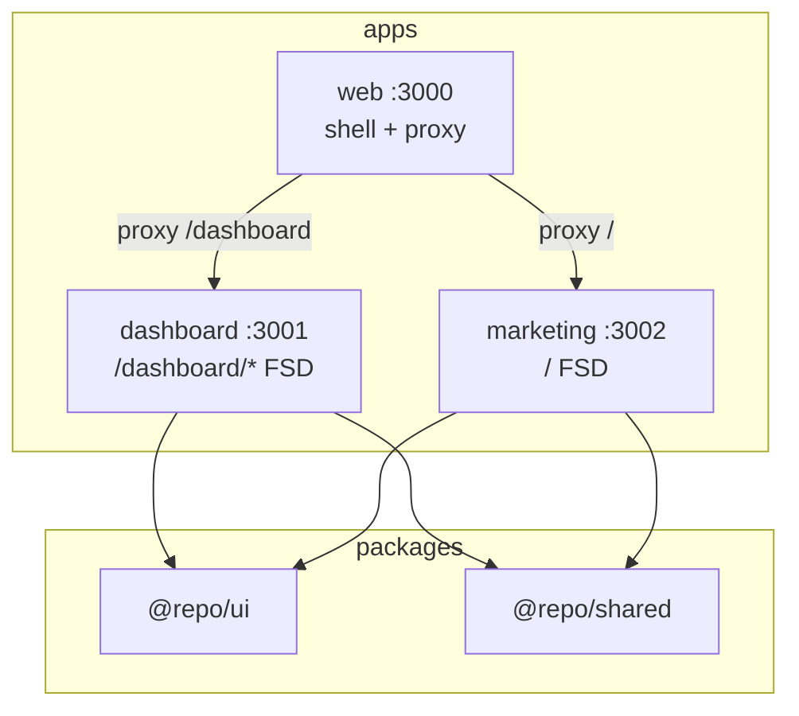

# vite-fsd-monorepo-workspace

[](https://vite.dev/)
[](https://turbo.build/)
[](https://react.dev/)
[](https://nodejs.org/)
[](LICENSE)

Projeto de **aprendizagem** sobre monorepo frontend com **Turborepo**, **Vite**, **Feature-Sliced Design (FSD)** e shell com proxy dev. Espelha o [next-monorepo-workspace](../next-monorepo-workspace) com stack SPA em vez de Next.js Multi-Zones.

> Documentação: [FSD](docs/FSD-GUIDE.md) | [Arquitetura](docs/ARCHITECTURE.md) | [Turborepo](docs/TURBOREPO-GUIDE.md)

---

## Sobre o projeto

Este repositório **não é um produto pronto para produção**. Ele existe para você estudar:

- **Monorepo** com npm workspaces + Turborepo
- **Feature-Sliced Design** — camadas, slices, public API
- **Vite** — bundler rápido para SPAs
- **Microfrontends em dev** — shell com proxy (equivalente aos rewrites do Next)
- **Packages compartilhados** — `@repo/ui`, `@repo/shared` via TSUp

### Comparativo com o monorepo Next

| Aspecto | next-monorepo-workspace | vite-fsd-monorepo-workspace |
|---------|-------------------------|----------------------------|
| Framework | Next.js 15 App Router | Vite 6 + React Router 7 |
| Arquitetura app | `src/app/` por rota | FSD (`pages`, `widgets`, `features`…) |
| Agregação de rotas | Multi-Zones (rewrites) | Shell + `server.proxy` |
| Roteamento | File-based (Next) | React Router + `basename` no dashboard |
| Deploy | SSR/SSG possível | SPA estática por app |

### O que está incluído

| Projeto | Tipo | Porta | Descrição |
|---------|------|-------|-----------|
| `web` | Application (shell) | 3000 | Proxy dev — ponto de entrada único |
| `dashboard` | Application (zona) | 3001 | Admin em `/dashboard/*` (FSD) |
| `marketing` | Application (zona) | 3002 | Landing pública em `/` (FSD) |
| `@repo/ui` | Package | — | Design system compartilhado |
| `@repo/shared` | Package | — | Types, utils, dados mock |
| `@repo/typescript-config` | Package | — | tsconfig base + vite |
| `@repo/eslint-config` | Package | — | ESLint + regras FSD |



---

## Pré-requisitos

- **Node.js** >= 20 (`.nvmrc` = `20`)
- **npm** >= 10

---

## Quick start

```bash
cd vite-fsd-monorepo-workspace
npm install
npm run dev
```

Acesse **http://localhost:3000** (shell):

| URL | Zona |
|-----|------|
| `/` | marketing |
| `/about` | marketing |
| `/features` | marketing |
| `/dashboard` | dashboard |
| `/dashboard/users` | dashboard |

Apps também rodam diretamente:

- marketing: http://localhost:3002
- dashboard: http://localhost:3001/dashboard/

---

## Estrutura FSD (exemplo marketing)

```
apps/marketing/src/
├── app/           # bootstrap, router, estilos globais
├── pages/         # composições de rota
├── widgets/       # site-header
├── features/      # theme-toggle
└── shared/        # config local (routes)
```

Regra de ouro: **importe apenas de camadas inferiores**. Veja [docs/FSD-GUIDE.md](docs/FSD-GUIDE.md).

---

## Scripts

| Comando | Descrição |
|---------|-----------|
| `npm run dev` | Sobe shell + zonas + watch dos packages |
| `npm run build` | Build de todos os workspaces |
| `npm run lint` | ESLint em todos os workspaces |
| `npm run type-check` | TypeScript `--noEmit` |
| `npm run syncpack:check` | Verifica versões consistentes |
| `npm run format` | Prettier |

### Filtros Turborepo

```bash
npx turbo dev --filter=marketing...
npx turbo build --filter=dashboard
npx turbo build --filter=@repo/*
```

---

## Documentação

| Guia | Conteúdo |
|------|----------|
| [FSD-GUIDE.md](docs/FSD-GUIDE.md) | Camadas, slices, regras de import |
| [ARCHITECTURE.md](docs/ARCHITECTURE.md) | Proxy shell, packages, deploy |
| [TURBOREPO-GUIDE.md](docs/TURBOREPO-GUIDE.md) | Pipeline, cache, Syncpack |
| [SETUP-FROM-SCRATCH.md](docs/SETUP-FROM-SCRATCH.md) | Recriar o monorepo do zero |
| [ADD-NEW-SLICE.md](docs/ADD-NEW-SLICE.md) | Adicionar feature/page/widget |

---

## Licença

MIT
