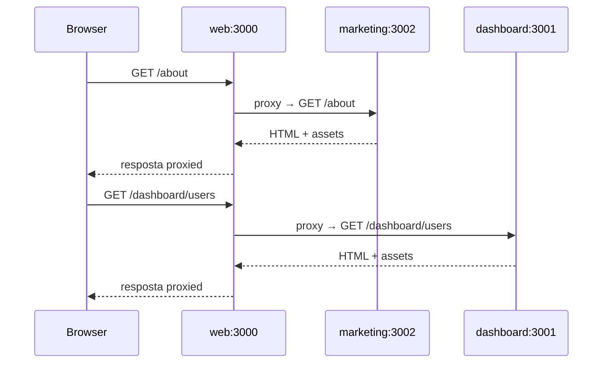

# Arquitetura — Shell + Zonas Vite

Este documento explica como as zonas se comunicam, o papel do FSD e quando usar apps vs packages.

---

## Visão geral

O monorepo implementa **microfrontends em dev** usando um **shell com proxy Vite**:

- Cada zona é um app Vite **independente** com build e deploy próprios
- O **shell** (`apps/web`) unifica a experiência via **`server.proxy`**
- Código compartilhado vive em **packages** buildados com TSUp
- Código específico de cada app segue **Feature-Sliced Design**



---

## Zonas

### Shell — `apps/web` (porta 3000)

Responsabilidades:

- Ponto de entrada único em dev
- `appType: 'custom'` — não compete com SPA fallback
- Proxy em `vite.config.ts`:
  - `/dashboard` → dashboard:3001
  - demais rotas → marketing:3002
- Página fallback explicativa quando acessado sem proxy ativo

### Marketing — `apps/marketing` (porta 3002)

- Zona pública: home, about, features
- FSD completo: pages, widgets, features
- React Router sem `basename`
- Header com link cross-zone para `/dashboard`

### Dashboard — `apps/dashboard` (porta 3001)

- Zona admin: overview, users, settings
- `base: '/dashboard/'` no Vite
- `basename="/dashboard"` no React Router
- FSD com entities (`user`) e features (`filter-users`)

---

## Proxy vs Multi-Zones (Next)

| | Next Multi-Zones | Vite Shell Proxy |
|--|------------------|------------------|
| Mecanismo | `rewrites` em next.config | `server.proxy` no Vite |
| Produção | Rewrites no shell Next | Reverse proxy (nginx, Caddy, Vercel) |
| Assets | `_next/static` por zona | `/assets`, `/@vite` por zona |
| SSR | Suportado | Não (SPA) |

Em produção, cada app gera `dist/` estático. O reverse proxy roteia:

```
/           → marketing dist
/dashboard  → dashboard dist
```

Exemplo nginx (didático):

```nginx
location /dashboard/ {
  proxy_pass http://dashboard-upstream/;
}
location / {
  proxy_pass http://marketing-upstream/;
}
```

---

## Packages

### `@repo/shared`

- Types: `User`, `PaginatedResponse`, `ZoneInfo`
- Utils: `formatDate`, `cn`
- Constantes: `MOCK_USERS`, `ZONES`
- Build: TSUp → ESM + `.d.ts`

### `@repo/ui`

- Componentes: Button, Card, Header, NavLink, PageShell, RoleBadge
- CSS: `@repo/ui/styles.css`
- Depende de `@repo/shared` para `cn()`
- Build: TSUp (sem `"use client"` — Vite não precisa)

---

## Grafo de dependências

```
@repo/shared
    ↑
@repo/ui
    ↑
marketing, dashboard, web
```

**Regra de ouro:** packages **nunca** importam apps.

Dentro de cada app, FSD impõe camadas locais (ver [FSD-GUIDE.md](./FSD-GUIDE.md)).

---

## Quando criar zona vs package vs slice FSD

| Cenário | Onde |
|---------|------|
| Novo domínio com deploy independente | `apps/<zona>` + proxy no shell |
| Componente usado em 2+ apps | `@repo/ui` ou `@repo/shared` |
| Feature específica de um app | slice FSD em `features/` |
| Entidade de negócio local | slice FSD em `entities/` |

---

## Variáveis de ambiente

Copie `.env.example` para `.env` na raiz:

```
DASHBOARD_URL=http://localhost:3001
MARKETING_URL=http://localhost:3002
```

O shell carrega env da raiz via `loadEnv` no `vite.config.ts`.

---

## Limitações (didáticas)

- Proxy dev não cobre todos os edge cases de HMR cross-zona
- Shell fallback é estático — em dev normal, você vê marketing/dashboard via proxy
- FSD ESLint rules são simplificadas — produção pode usar `eslint-plugin-boundaries`
